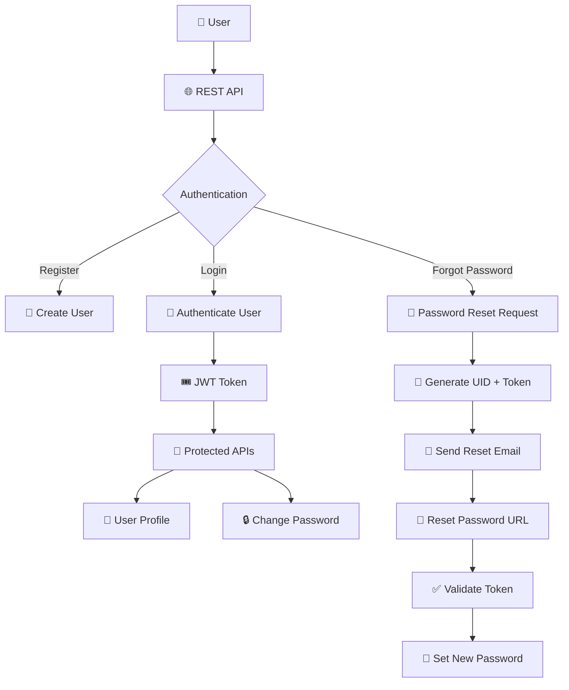

<div align="center">

# 🔐 Django Authentication REST API

### A Complete Authentication System built with Django REST Framework

<p>
  <strong>Custom User Model</strong> •
  <strong>JWT Authentication</strong> •
  <strong>Password Reset</strong> •
  <strong>Email Authentication</strong>
</p>

</div>

---

## ✨ Overview

**Django Authentication REST API** is a complete authentication backend built using **Django** and **Django REST Framework**.

The project implements a custom authentication system where users can register and authenticate using their **email address**, manage their profile, change their password, and securely reset forgotten passwords through email.

This project was built to understand how a real-world **REST API authentication system** is designed and implemented using Django REST Framework.

---

## 🚀 Features

| Feature                 | Description                                         |
| ----------------------- | --------------------------------------------------- |
| 👤 Custom User Model    | Custom user implementation using `AbstractBaseUser` |
| 📧 Email Authentication | Email address used as the login identifier          |
| 📝 User Registration    | Register users with validation                      |
| 🔑 Login                | Authenticate users using email and password         |
| 🛡️ JWT Authentication  | Token-based authentication for protected APIs       |
| 👨‍💻 User Profile      | Retrieve authenticated user information             |
| 🔒 Change Password      | Authenticated users can change their password       |
| 📩 Forgot Password      | Request a password reset through email              |
| 🔐 Reset Password       | Secure password reset using token validation        |
| 🔢 Base64 UID           | URL-safe encoded user ID for reset links            |
| 📬 SMTP Email           | Password reset emails sent through SMTP             |
| 🧪 Postman              | Complete API collection included                    |

---

# 🏗️ Authentication Architecture



---

# 🛠️ Tech Stack

<div align="center">

| Technology                      | Usage                   |
| ------------------------------  | ----------------------- |
| 🐍 **Python**                  | Programming Language    |
| 🎯 **Django**                  | Backend Framework       |
| ⚡ **Django REST Framework**   | REST API Development    |
| 🔐 **JWT**                     | Authentication          |
| 🗄️ **SQLite**                  | Database                |
| 📧 **SMTP**                    | Email Service           |
| 🧪 **Postman**                 | API Testing             |
| 🔒 **Django Password Hashing** | Secure Password Storage |

</div>

---

# 📂 Project Structure

```text
django-auth-api/
│
├── 📁 auth_api/
│   │
│   ├── 📁 accounts/
│   │   ├── 📁 migrations/
│   │   ├── 📄 managers.py
│   │   ├── 📄 models.py
│   │   ├── 📄 serializers.py
│   │   ├── 📄 views.py
│   │   └── 📄 urls.py
│   │
│   ├── 📁 auth_api/
│   │   ├── 📄 settings.py
│   │   ├── 📄 urls.py
│   │   ├── 📄 asgi.py
│   │   └── 📄 wsgi.py
│   │
│   ├── 🔒 .env
│   └── 📄 manage.py
│
├── 🚫 .gitignore
├── 🧪 DJANGO AUTH API.postman_collection.json
├── 📄 requirement.txt
└── 📖 README.md
```

> 🔒 `.env` and `.venv` are intentionally excluded from Git version control.

---

# 👤 Custom User Model

The project does not use Django's default `User` model.

Instead, it implements a custom user model using:

```python
AbstractBaseUser
```

The user's **email address** is used as the authentication identifier.

```python
class User(AbstractBaseUser):

    email = models.EmailField(
        max_length=255,
        unique=True
    )

    name = models.CharField(max_length=200)

    tc = models.BooleanField()

    is_active = models.BooleanField(default=True)

    is_admin = models.BooleanField(default=False)

    USERNAME_FIELD = "email"
```

### Why a Custom User Model?

Using a custom user model provides flexibility to:

* Use email instead of username
* Add application-specific user fields
* Customize authentication behaviour
* Customize user creation
* Extend the authentication system in the future

---

# 🔄 User Authentication Flow

```text
                    ┌─────────────────┐
                    │   👤 Register   │
                    └────────┬────────┘
                             ↓
                    ┌─────────────────┐
                    │  User Created   │
                    └────────┬────────┘
                             ↓
                    ┌─────────────────┐
                    │    🔑 Login     │
                    └────────┬────────┘
                             ↓
                    ┌─────────────────┐
                    │   🎟️ JWT Token  │
                    └────────┬────────┘
                             ↓
              ┌──────────────┴──────────────┐
              ↓                             ↓
       👤 User Profile               🔒 Protected APIs
              │                             │
              └──────────────┬──────────────┘
                             ↓
                    🔐 Authenticated User
```

---

# 📡 API Endpoints

## 🔐 Authentication APIs

| Method | Endpoint                                | Authentication | Description               |
| ------ | --------------------------------------- | -------------- | ------------------------- |
| `POST` | `/api/user/register`                    | ❌              | Register a new user       |
| `POST` | `/api/user/login`                       | ❌              | Login with email/password |
| `GET`  | `/api/user/profile`                     | ✅              | Get authenticated user    |
| `POST` | `/api/user/changepassword`              | ✅              | Change current password   |
| `POST` | `/api/user/resetpassword`               | ❌              | Request password reset    |
| `POST` | `/api/user/resetpassword/<uid>/<token>` | ❌              | Reset password            |

---

# 📝 1. User Registration

### Endpoint

```http
POST /api/user/register
```

### Request

```json
{
    "email": "user@example.com",
    "name": "John Doe",
    "tc": true,
    "password": "Password@123",
    "password2": "Password@123"
}
```

### Flow

```text
Request
   ↓
Serializer Validation
   ↓
Email Validation
   ↓
Password Validation
   ↓
Password Hashing
   ↓
Create User
   ↓
Response
```

---

# 🔑 2. User Login

### Endpoint

```http
POST /api/user/login
```

### Request

```json
{
    "email": "user@example.com",
    "password": "Password@123"
}
```

### Authentication

```text
Email + Password
       ↓
   authenticate()
       ↓
   User Found?
    ↙       ↘
  YES        NO
   ↓          ↓
 JWT Token   Error
```

---

# 👤 3. User Profile

### Endpoint

```http
GET /api/user/profile
```

🔒 **Authentication Required**

```http
Authorization: Bearer <access_token>
```

### Example Response

```json
{
    "id": 1,
    "email": "user@example.com",
    "name": "John Doe"
}
```

---

# 🔒 4. Change Password

### Endpoint

```http
POST /api/user/changepassword
```

🔒 **Authentication Required**

### Request

```json
{
    "password": "NewPassword@123",
    "password2": "NewPassword@123"
}
```

### Password Flow

```text
New Password
     +
Confirm Password
     ↓
Serializer Validation
     ↓
Passwords Match?
   ↙          ↘
 YES           NO
  ↓             ↓
set_password()  ❌ Validation Error
  ↓
Database Updated
```

---

# 📩 5. Forgot Password

### Endpoint

```http
POST /api/user/resetpassword
```

### Request

```json
{
    "email": "user@example.com"
}
```

The API generates:

```text
User ID
   ↓
URL-safe Base64 Encoding
   ↓
Reset Token
   ↓
Reset URL
   ↓
📧 Email
```

Example reset URL:

```text
http://localhost:3000/api/user/resetpassword/NQ/token_here
```

---

# 🔐 6. Reset Password

### Endpoint

```http
POST /api/user/resetpassword/<uid>/<token>
```

### Request

```json
{
    "password": "NewPassword@123",
    "password2": "NewPassword@123"
}
```

### Token Validation Flow

```text
Encoded UID
    ↓
Base64 Decode
    ↓
Find User
    ↓
Validate Reset Token
    ↓
Token Valid?
   ↙       ↘
 YES       NO
  ↓         ↓
New Password
  ↓
set_password()
  ↓
Save User
  ↓
✅ Password Reset
```

---

# 📬 Email Configuration

The password reset functionality uses Django's SMTP email backend.

Create an environment file:

```text
auth_api/.env
```

Example:

```env
SECRET_KEY=your-secret-key

EMAIL_HOST=smtp.gmail.com
EMAIL_PORT=587
EMAIL_USE_TLS=True
EMAIL_HOST_USER=your-email@gmail.com
EMAIL_HOST_PASSWORD=your-app-password
```

> ⚠️ Never commit `.env` to GitHub.

---

# ⚙️ Installation

## 1️⃣ Clone the Repository

```bash
git clone https://github.com/Hitendra15/django-auth-api.git
```

```bash
cd django-auth-api
```

---

## 2️⃣ Create Virtual Environment

```bash
python -m venv .venv
```

### Windows

```bash
.venv\Scripts\activate
```

### Linux / macOS

```bash
source .venv/bin/activate
```

---

## 3️⃣ Install Dependencies

```bash
pip install -r requirement.txt
```

---

## 4️⃣ Configure Environment Variables

Create:

```text
auth_api/.env
```

Add the required Django and email configuration.

---

## 5️⃣ Run Migrations

```bash
cd auth_api
```

```bash
python manage.py makemigrations
python manage.py migrate
```

---

## 6️⃣ Create Superuser

```bash
python manage.py createsuperuser
```

---

## 7️⃣ Start Development Server

```bash
python manage.py runserver
```

The API will be available at:

```text
http://127.0.0.1:8000/
```

---

# 🧪 Postman Collection

A complete Postman collection is included:

```text
DJANGO AUTH API.postman_collection.json
```

### Recommended Testing Order

```text
1. 📝 Register
       ↓
2. 🔑 Login
       ↓
3. 🎟️ Get Token
       ↓
4. 👤 Get Profile
       ↓
5. 🔒 Change Password
       ↓
6. 📩 Forgot Password
       ↓
7. 🔐 Reset Password
```

Import the Postman collection into Postman and configure your authentication token for protected endpoints.

---

# 🛡️ Security

This project follows Django's built-in password security mechanisms.

### Password Security

Passwords are never stored as plain text.

Django's password hashing mechanism is used:

```python
user.set_password(password)
```

### Protected Endpoints

Authenticated APIs use:

```python
permission_classes = [IsAuthenticated]
```

### Environment Variables

Sensitive configuration is stored outside the source code:

```text
.env
```

### Git Protection

The repository ignores:

```text
.env
.venv/
__pycache__/
*.pyc
```

---

# 🧠 Concepts Demonstrated

This project demonstrates practical understanding of:

```text
🐍 Python
   │
   ├── Object-Oriented Programming
   ├── Functions
   └── Exception Handling
   │
   ▼
🎯 Django
   │
   ├── Models
   ├── Custom User Model
   ├── Managers
   ├── Migrations
   └── Authentication
   │
   ▼
⚡ Django REST Framework
   │
   ├── APIView
   ├── Serializers
   ├── Validation
   ├── Permissions
   └── Authentication
   │
   ▼
🔐 Security
   │
   ├── Password Hashing
   ├── JWT
   ├── Password Reset Tokens
   └── Environment Variables
   │
   ▼
📧 Email
   │
   └── SMTP
```

---

# 🔮 Future Improvements

The project can be extended with:

* ✉️ Email verification
* 🔄 Refresh token rotation
* 🚫 Login rate limiting
* 🔐 Two-factor authentication
* 🌐 Google / GitHub OAuth
* 📚 Swagger / OpenAPI documentation
* 🧪 Automated unit & API tests
* 🐳 Docker support
* 🚀 Production deployment
* ⚙️ CI/CD pipeline
* 📊 API monitoring and logging

---

# 📌 Project Status

<div align="center">

### 🟢 Active Development

This project is continuously being improved while exploring advanced Django REST Framework concepts and production-level API development.

</div>

---

# 👨‍💻 Author

<div align="center">

## Hitendra Marathe

**Python • Django • Django REST Framework Developer**

Building scalable backend systems and exploring modern API development.

</div>

---

<div align="center">

### ⭐ If you found this project useful, consider giving it a star!

**Built with ❤️ using Django & Django REST Framework**

</div>
